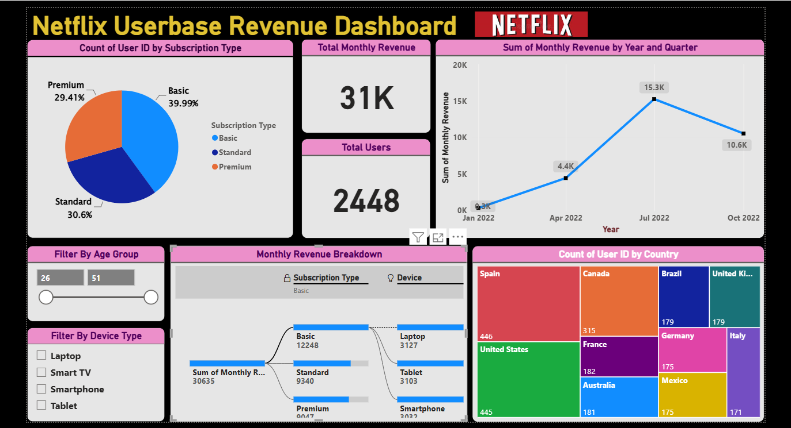

---

## 📸 Dashboard Preview

  
   
  Interactive dashboard built with Power BI showing key Netflix user metrics

---

# 🎬 Netflix Userbase Revenue Dashboard

> **An interactive Power BI dashboard analyzing Netflix user subscriptions, revenue trends, and global user distribution.**

---

## 📊 Project Overview

This project provides a comprehensive analysis of Netflix's userbase using Power BI. The dashboard visualizes key metrics including:

| Category | Metrics |
|----------|---------|
| 📈 **Revenue** | Monthly revenue trends by quarter and year |
| 🌍 **Users** | Global user distribution across countries |
| 💳 **Subscriptions** | Basic, Standard, Premium plan analysis |
| 📱 **Devices** | Smartphone, Smart TV, Laptop, Tablet usage |
| 👥 **Demographics** | User distribution by age group |

---

## 🎯 Key Visualizations Included

| Visualization | Insights |
|---------------|----------|
| 📊 **Donut Chart** | Subscription Type Distribution |
| 📈 **Bar Chart** | Quarterly Revenue Trends |
| 🌍 **Map** | User Distribution by Country |
| 🔢 **KPI Cards** | Total Users & Monthly Revenue |
| 📱 **Device Chart** | Device Usage Patterns |
| 🎚️ **Filters** | Age Group & Device Type |

---

## 📥 How to Interact with the Dashboard

- Click on **Subscription Type** to filter all visuals
- Use **Age Group slider** to see user demographics
- Select **Device Type** to analyze device-specific trends
- Hover over **charts** for detailed tooltips

---

## 🎯 Key Insights

### 📊 Subscription Distribution

| Plan | Percentage | Users (Approx.) |
|------|------------|-----------------|
| **Basic** | 39.99% | ~979 |
| **Standard** | 30.6% | ~749 |
| **Premium** | 29.41% | ~720 |

### 💰 Revenue Metrics

| Metric | Value |
|--------|-------|
| **Total Users** | 2,448 |
| **Total Monthly Revenue** | ₹31K |

### 📅 Revenue by Quarter

| Quarter | Revenue |
|---------|---------|
| **Q2 2022 (Apr)** | ₹4.4K |
| **Q3 2022 (Jul)** | ₹15.3K |
| **Q4 2022 (Oct)** | ₹10.6K |

### 🌍 Top Countries by Users

| Country | User Count |
|---------|------------|
| **United States** | Highest |
| **India** | High |
| **Brazil** | High |
| **United Kingdom** | Moderate |
| **Canada** | Moderate |

### 📱 Device Distribution

| Device | Share |
|--------|-------|
| **Smartphone** | Largest |
| **Smart TV** | Large |
| **Laptop** | Moderate |
| **Tablet** | Small |

---

## 🛠️ Tech Stack

| Tool | Purpose |
|------|---------|
| **Power BI** | Dashboard creation & visualization |
| **Power Query** | Data cleaning & transformation |
| **DAX** | Calculated measures & KPIs |
| **Excel / CSV** | Data storage |

---

## 📁 Dataset Description

| Column | Description |
|--------|-------------|
| User ID | Unique user identifier |
| Subscription Type | Basic, Standard, Premium |
| Monthly Revenue | Revenue per user |
| Country | User's country |
| Device | Device used (Smartphone, TV, etc.) |
| Age Group | User age bracket |
| Quarter | Revenue quarter |
| Year | Revenue year |

---
